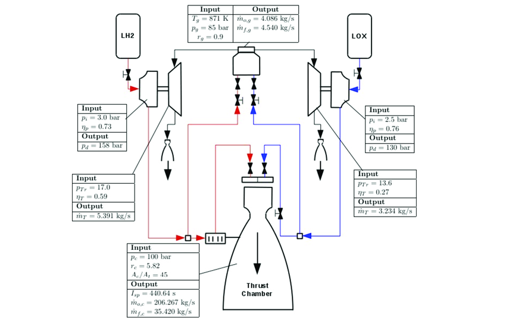
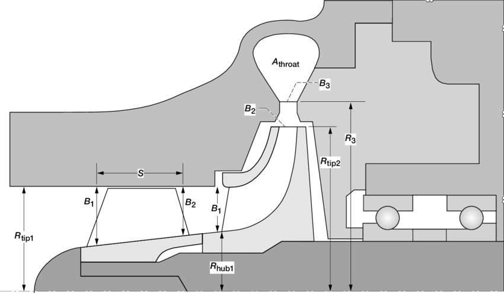

# Turbo-Pump
Custom designed software for turbomachinery and propulsion analysis.

Steady State Engine Anylasis:
The first file is used for steady state anylasis of a liquid rocket engine, Utilizes CEA from NASA combustion website. 
Inputs include pressure loss correlations, turboump parameters, and exepcted thrust etc. 

Based on this paper: https://www.researchgate.net/publication/325766412_Modeling_and_Analysis_of_a_LOXEthanol_Liquid_Rocket_Engine

PUMPA Meanline NASA code:

PUMPA code is designed for impeller off design meanline generating Head v Flow and Exit Pressure v Flow Anylasis
Code PUMPA1 file is used for Geometry inputs , while PUMPA2 is used for basic entry geometry but secondary R2 A2 geometry in the 
graph us unkown utilizes a newton numerical method to find. Units are in imperial.

Generated Graph 1:

IMPULSE Turbine script:

This simple script is based on NASA and Rocketdeyne 1D meanline method, needs to use NASA SP8110 "NASA Liquid Rocket Engine Turbines" this is more for design anylasis. The method only has one set of Nozzles and Rotors (or buckets), can be modeified to have two rows like a more advanced Curtis Impulse turbine.

