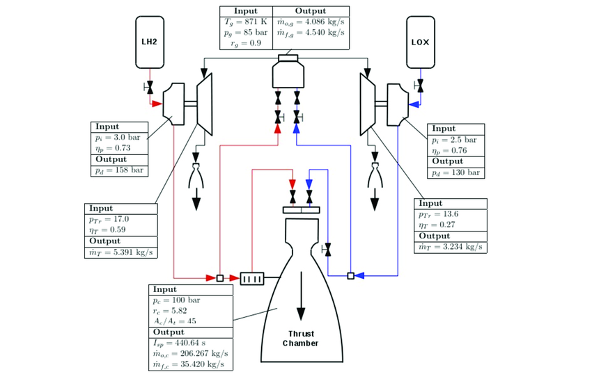
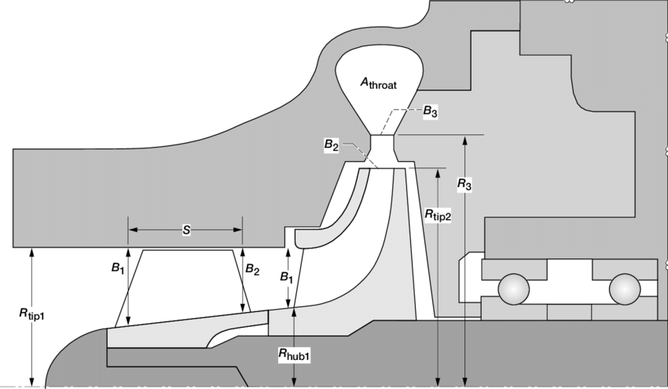
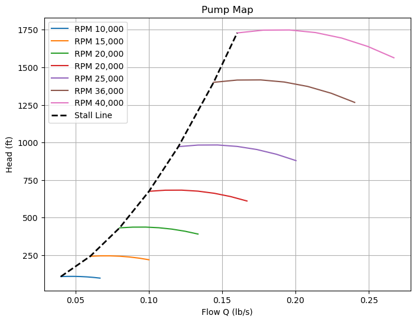

# Turbo-Pump
Custom designed software for turbomachinery and propulsion analysis.

Steady State Engine Anylasis:
The first file is used for steady state anylasis of a liquid rocket engine, It Utilizes CEA from the NASA combustion website. 
Inputs include pressure loss correlations, turboump parameters, and expected thrust etc. 

Based on this paper: https://www.researchgate.net/publication/325766412_Modeling_and_Analysis_of_a_LOXEthanol_Liquid_Rocket_Engine

PUMPA Meanline NASA code:

PUMPA code is designed for impeller off design performance using meanline methods. Parameters produced include Head v Flow rate and Exit Pressure v Flow rate
Code PUMPA1 file is used for Geometry inputs , while PUMPA2 is used for basic entry geometry but secondary R2 A2 geometry in the 
graph utilizes a newton numerical method to find the functions roots. Units are in imperial.

Generated Graph 1:

IMPULSE Turbine script:

This simple script is based on NASA and Rocketdeyne 1D meanline method, needs to use NASA SP8110 "NASA Liquid Rocket Engine Turbines" this is more for design anylasis. The method only has one set of Nozzles and Rotors (or buckets), can be modified to have two rows like a more advanced Curtis Impulse turbine.

